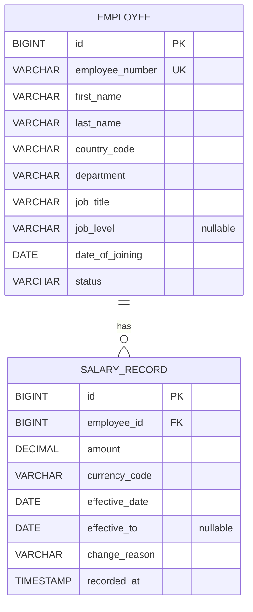

My first thought was to keep employee details and salary details together in one table.

**Initial single-table idea**

| Field | Notes |
|---|---|
| `id` | Primary key |
| `employeeNumber` | Employee identifier |
| `firstName`, `lastName` | Employee name |
| `countryCode`, `department` | Employee location and department |
| `jobTitle`, `jobLevel` | Employee role details |
| `amount`, `currencyCode` | Salary value and currency |
| `effectiveDate` | Date the salary takes effect |

That raised a history trade-off. If a salary update replaces the old amount, the previous salary
is lost. If a new row is inserted for every change, employee details are duplicated across rows;
the table also needs a condition such as an `isCurrent` flag to identify the active salary and
keep that flag correct as new rows are added. This made the single-table approach harder to keep
consistent as salary history grows.

I then compared keeping only current pay on `Employee` with a compensation-change approval
workflow:

**Current pay stored on Employee**

| Field | Notes |
|---|---|
| `id` | Primary key |
| `employeeNumber` | Employee identifier |
| `firstName`, `lastName` | Employee name |
| `countryCode`, `department` | Employee location and department |
| `jobTitle`, `jobLevel` | Employee role details |
| `currentSalary` | Current salary amount (`decimal`) |
| `currencyCode` | Currency for the current salary |
| `dateOfJoining`, `status` | Employment details |

This keeps the data shape small, but updating currentSalary would replace the old value and lose
the employee's salary history.

**Compensation changes with an approval workflow**

**Employee**

| Field | Notes |
|---|---|
| `id` | Primary key |
| `employeeNumber` | Employee identifier |
| `firstName`, `lastName` | Employee name |
| `countryCode`, `department` | Employee location and department |
| `jobTitle`, `jobLevel` | Employee role details |
| `dateOfJoining`, `status` | Employment details |

**SalaryChange**

| Field | Notes |
|---|---|
| `id` | Primary key |
| `employeeId` | Foreign key to `Employee` |
| `proposedAmount` | Proposed salary amount (`decimal`) |
| `currencyCode` | Currency for the proposed amount |
| `effectiveDate` | Proposed salary's effective date |
| `reason` | Reason for the proposed change |
| `status` | Approval state: `PENDING`, `APPROVED`, or `REJECTED` |

**Approval**

| Field | Notes |
|---|---|
| `id` | Primary key |
| `salaryChangeId` | Foreign key to `SalaryChange` |
| `reviewer` | Person reviewing the change |
| `decision` | Review decision |
| `decidedAt` | Time the decision was made |
| `comment` | Reviewer comment |

This preserves proposed changes and decisions, but requires approval roles and workflow rules that
are outside the current scope.

I modified the design to find a middle ground between those models.

## Current model: employee profile with effective-dated salary records

Employee profile data is stored once in `Employee`. Each salary change is stored as a separate
`SalaryRecord` associated with that employee.

**Employee**

| Field | Notes |
|---|---|
| `id` | Generated primary key (`Long`) |
| `employeeNumber` | Required, unique employee identifier (up to 24 characters) |
| `firstName`, `lastName` | Required employee name fields |
| `countryCode` | Required two-letter country code |
| `department` | Required department name |
| `jobTitle` | Required job title |
| `jobLevel` | Optional job level |
| `dateOfJoining` | Required joining date |
| `status` | Required employment status: `ACTIVE` or `INACTIVE` |

**SalaryRecord**

| Field | Notes |
|---|---|
| `id` | Generated primary key (`Long`) |
| `employee` | Required foreign key to `Employee`; many salary records may belong to one employee |
| `amount` | Required salary amount (`decimal`, precision 19, scale 2) |
| `currencyCode` | Required three-letter currency code |
| `effectiveDate` | Required first day this salary amount applies |
| `effectiveTo` | Optional last day this salary amount applies; `NULL` represents an open-ended record |
| `changeReason` | Required reason for the salary record (up to 240 characters) |
| `recordedAt` | Timestamp when the record was created |

A unique constraint prevents two salary records for the same employee from having the same
`effectiveDate`. Salary periods are inclusive: when a new record takes effect, the previous record
ends the day before it. A record is current on a given date when its `effectiveDate` is on or before
that date and its `effectiveTo` is either `NULL` or on or after that date. This lets searches select
current pay without counting superseded records, while still allowing historical salary periods to
be queried.

I chose this model because it keeps employee details in one place, avoiding repeated profile data
when salary changes are added, while preserving each salary period for history and date-based
queries. The single-table option either overwrites old pay or duplicates employee data across
salary rows and needs extra rules to identify current pay. The approval-workflow option also keeps
salary history, but adds proposed-change and approval entities, workflow states, and authorization
rules that the single HR Manager use case does not need. Separate effective-dated records preserve
the important history with a smaller model and simpler write/query rules.

## Schema reference

The diagram shows the implemented relationship. An employee can have no salary records yet or many
records over time; every salary record belongs to exactly one employee.

Types below describe the logical schema represented by the JPA entities. Exact physical SQL types
may vary slightly by database.

### `employees`

| Column | Application type | Required | Constraints / meaning |
|---|---|---:|---|
| `id` | `Long` | Yes | Generated primary key |
| `employee_number` | `String` | Yes | Unique; maximum 24 characters |
| `first_name` | `String` | Yes | Maximum 80 characters |
| `last_name` | `String` | Yes | Maximum 80 characters |
| `country_code` | `String` | Yes | Two-letter country code |
| `department` | `String` | Yes | Maximum 80 characters |
| `job_title` | `String` | Yes | Maximum 120 characters |
| `job_level` | `String` | No | Maximum 40 characters |
| `date_of_joining` | `LocalDate` | Yes | Employee start date |
| `status` | `EmploymentStatus` | Yes | Stored as text: `ACTIVE` or `INACTIVE` |

### `salary_records`

| Column | Application type | Required | Constraints / meaning |
|---|---|---:|---|
| `id` | `Long` | Yes | Generated primary key |
| `employee_id` | `Long` | Yes | Foreign key to `employees.id` |
| `amount` | `BigDecimal` | Yes | Precision 19, scale 2; salary amount must be positive at the API boundary |
| `currency_code` | `String` | Yes | Three-letter code; validated at the API boundary |
| `effective_date` | `LocalDate` | Yes | First date this salary applies |
| `effective_to` | `LocalDate` | No | Inclusive last date this salary applies; null means no end date is currently recorded |
| `change_reason` | `String` | Yes | Maximum 240 characters |
| `recorded_at` | `Instant` | Yes | Set when the record is created; not updated afterward |

### Keys, indexes, and interval rules

- `employees.id` and `salary_records.id` are generated primary keys.
- `employees.employee_number` has a unique constraint so an employee identifier cannot be reused.
- `salary_records.employee_id` references `employees.id`; a database foreign key requires each
  salary record to have an employee.
- `(salary_records.employee_id, salary_records.effective_date)` is unique, preventing two salary
  changes for the same employee from starting on the same day. An index on these columns supports
  employee history lookups.
- An index on `(employees.country_code, employees.department)` supports common employee filters.
- The service maintains non-overlapping, inclusive salary periods when a salary record is added:
  it ends the prior period the day before the new record starts, and sets the new period's end to
  the day before the next scheduled record, if one exists. The database currently does not enforce
  interval non-overlap or `effective_to >= effective_date` with a check constraint.
- A salary record is current as of a date when `effective_date <= asOfDate` and
  (`effective_to` is null or `effective_to >= asOfDate`). The `currentOnly` search applies this
  predicate using the current date; historical queries can use the effective-date range filters.
